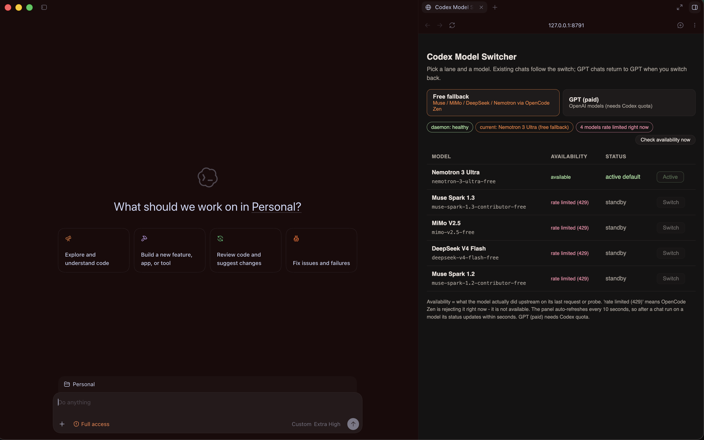
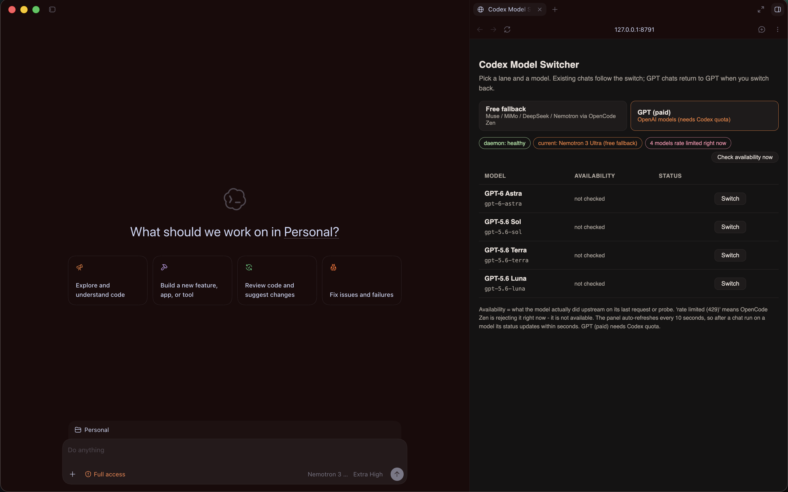
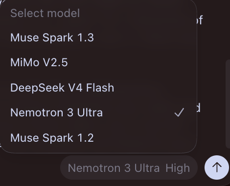
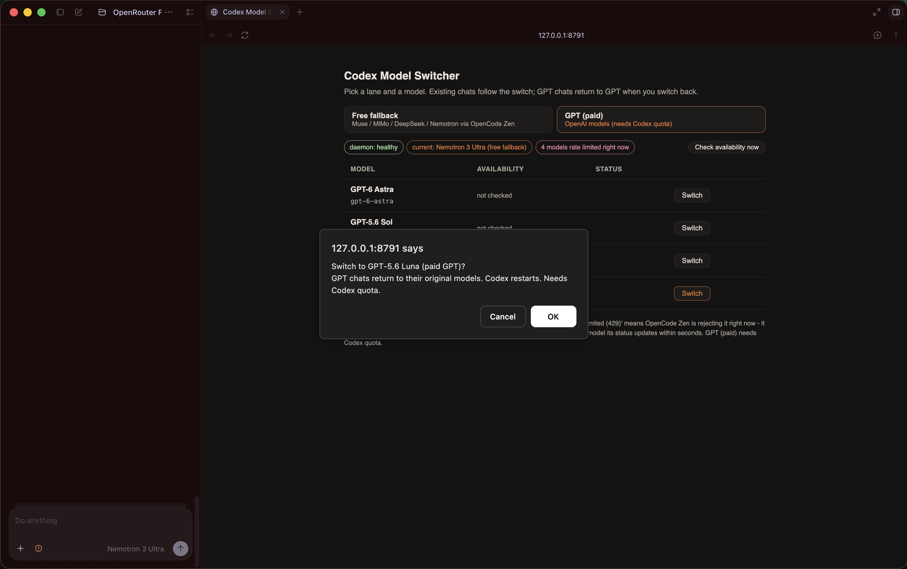

# Codex Harness Free Model Router

A user-configured local panel and skill for switching a Codex harness between
free and paid model routes.

The package starts with no provider presets and no model presets. It does not
assume which services, models, API keys, limits, or paid routes you use. Add
your own values before you run a model.

Everything is customizable.

## What this package does

| Area | User-controlled behavior |
| --- | --- |
| Providers | Add any provider with an OpenAI-compatible endpoint. |
| Models | Add every model ID and friendly name yourself. |
| Lanes | Mark each model as `free` or `paid`. |
| Availability | The panel shows whether each free model answers right now. |
| Fallback | Set the Default Fallback Rules for your own usage limits. |
| Credentials | Enter a key for one run or name an approved environment variable. |
| Codex route | Write a local profile that points the harness to your selected route. |
| Local website | Change the panel port, daemon port, profile name, and other settings. |

The package does not choose a provider for you. It does not choose a model for
you. It does not store an API key in the repository.

## Screenshots are examples only

These screenshots show the visual style of the panel. The names and values in
the screenshots are examples from one setup. They are not built-in presets and
are not required for your setup.

### Example free fallback lane



### Example paid lane



### Example model menu



### Example switch confirmation



## How the route works

```text
Codex task
    -> usage check
    -> Default Fallback Rules
    -> local daemon or direct provider route
    -> your configured model
```

When the free route is active, the daemon sends the request to your configured
outside provider. The normal Codex model does not receive that request. The
router reports `uses_codex_quota=false` only after the selected route passes a
health or request check.

If Codex cannot start, the direct runner can call a configured model without
Codex. That route may not provide the full Codex tool surface.

## Default Fallback Rules

The package provides generic starting values. You can change every value.

| Rule | Starting value | Meaning |
| --- | ---: | --- |
| Five-hour remaining threshold | 5% | A five-hour fallback may start at or below this value. |
| Weekly remaining threshold | 10% | A weekly safety stop starts at or below this value. |
| Five-hour weekly gate | 25% | The five-hour rule needs weekly remaining usage below this value. |
| Weekly stop | On | A current explicit user override is required to continue below the weekly threshold. |
| Free-only mode | On | Prevents an unreviewed paid route from the fallback lane. |

The default five-hour rule needs five-hour remaining usage at or below 5% and
weekly remaining usage below 25% and above 10%.

The default weekly rule stops at 10% or less. A user can explicitly override
that stop for the current task. The skill must not reuse an old override.

Missing or unclear usage data stops the route with `usage_unknown`.

## Start the local website

The website runs on your computer. It binds to `127.0.0.1` by default.

```bash
cd skill
./scripts/start_free_model_router_panel.sh
```

Open the printed local address in the Codex built-in browser or in another
browser. The panel starts empty. Add a provider and at least one model before
you select a route.

The panel lets you:

1. Add a provider name, provider ID, base URL, key variable name, and API style.
2. Add model IDs, friendly names, provider links, and free or paid lanes.
3. Enter a key for the current run after a confirmation step.
4. Scan only configured key variable names after a confirmation step.
5. Change the Default Fallback Rules.
6. Switch the active model and write a Codex profile.
7. Check whether each free model answers right now.

The panel never scans the environment on page load. It never displays a key.
The lane that you are viewing stays selected across refreshes.

## Check model availability

A model can be configured and still be unusable. Free tiers return `429 Too
Many Requests` when a usage window is spent, and a switch onto that model
fails until the window resets.

The daemon records the real upstream outcome for its model after every
request and every probe. The panel reads those outcomes and shows them in the
Availability column:

| Status | Meaning |
| --- | --- |
| `available` | The last request or probe reached the model. |
| `rate limited (429)` | The provider answered 429. The panel disables Switch for that model. |
| `error` | The provider answered with another failure. |
| `unknown` | A request-shape or credential problem, which does not prove the model is down. |
| `not checked` | The daemon has not talked to that model yet. |

Use the **Check availability** button for a live check. The daemon sends one
tiny request (a cap of 32 output tokens, because some providers reject caps
below 16) and records the result. Checks are throttled to one probe per model
every 2 minutes, so repeated clicks stay cheap. The page also refreshes
quietly every 10 seconds, so a model that starts returning 429 during real
work shows as rate limited without a manual refresh.

You can read or probe the same data from the command line:

```bash
curl http://127.0.0.1:4242/v1/status
curl "http://127.0.0.1:4242/v1/status?probe=1"
```

Outcomes persist in `status.json` next to your configuration file, or where
ever `MODEL_ROUTER_STATUS_PATH` points. The panel never reports a route as
usable while its model is rate limited.

## Add a provider and model

You can enter values in the panel or create a private JSON file from
[`skill/config.example.json`](skill/config.example.json).

Each provider needs:

- a lowercase provider ID;
- a display name;
- an `http` or `https` base URL;
- an optional uppercase environment variable name for its key; and
- `responses` or `chat` as its API style.

Each model needs:

- the exact model ID expected by the provider;
- a friendly display name;
- the provider ID; and
- either the `free` or `paid` lane.

The package validates these values. It does not guess them.

## Start the free model router daemon

After you configure a free provider and model, start the daemon:

```bash
cd skill
./scripts/start_free_model_router_daemon.sh
```

The daemon reads the active provider and model from your private configuration.
It exposes a local OpenAI-compatible endpoint for the Codex profile. It binds
to `127.0.0.1` and does not print request bodies or authorization headers.

To select values from the command line, set these environment variables before
starting it:

```text
MODEL_ROUTER_CONFIG
MODEL_ROUTER_PROVIDER_ID
MODEL_ROUTER_MODEL_ID
MODEL_ROUTER_DAEMON_PORT
```

Do not put a key in any of these variables. The key belongs in the provider key
environment variable that you configured.

## Switch the Codex harness

Select a configured model in the panel, confirm the switch, and start a new
Codex process with the generated profile name:

```bash
codex exec --profile free-model-router "your task"
```

The profile contains the model ID and endpoint settings. It does not contain a
key. A profile on disk is not proof that Codex loaded it. Check the daemon
health and the new process before relying on the route.

The command-line helper is also available:

```bash
cd skill
./scripts/select_router_model.sh <configured-model-id>
```

Paid models use the provider route that you configured. Free models use the
local daemon. Everything remains customizable.

## Run without Codex

Use the direct runner when Codex cannot start or has no usable quota:

```bash
cd skill
./scripts/run_external_model.py \
  --base-url <provider-base-url> \
  --model-id <configured-model-id> \
  --api-key-env <configured-key-variable> \
  "your task"
```

The runner does not call Codex. It supports a configured Responses API or Chat
Completions API. Tool and document support depends on the provider and model.

## Customization reference

| Setting | Starting value | Customization |
| --- | --- | --- |
| Configuration file | `~/.config/free-model-router/config.json` | Set `MODEL_ROUTER_CONFIG`. |
| Availability file | `~/.config/free-model-router/status.json` | Set `MODEL_ROUTER_STATUS_PATH`. |
| Panel port | `8791` | Set `MODEL_ROUTER_PANEL_PORT`. |
| Daemon port | `4242` | Set `MODEL_ROUTER_DAEMON_PORT` or edit the config. |
| Profile name | `free-model-router` | Edit `app.profile_name`. |
| Provider order | Empty | Edit `fallback.provider_order`. |
| Model order | Empty | Edit `fallback.model_order`. |
| Default Fallback Rules | 5%, 10%, 25% | Edit the `fallback` values. |
| Free-only safety | On | Change only after reviewing the route. |

The model catalog is intentionally empty. Add models in the panel or in your
private configuration. Do not copy another user's catalog without checking the
model IDs, pricing, limits, tool support, and document support.

## Credentials and approval

The skill tells the agent to ask before it scans for keys. A user can also enter
a key in the panel for one run. The key remains in process memory and is not
written to the configuration file.

Use a provider-supported credential store or a private environment variable for
longer use. Never put a key in this repository, a screenshot, a prompt, a log,
or a GitHub issue.

## File layout

| Path | Purpose |
| --- | --- |
| `skill/SKILL.md` | The user-focused skill. |
| `skill/config.example.json` | Empty configuration example with customizable rules. |
| `skill/scripts/router_config.py` | Configuration loading and validation. |
| `skill/scripts/decide_default_fallback.py` | Default Fallback Rules decision helper. |
| `skill/scripts/free_model_router_daemon.py` | Generic local daemon. |
| `skill/scripts/free_model_router_panel.py` | Generic local website server. |
| `skill/scripts/start_free_model_router_daemon.sh` | Start the daemon. |
| `skill/scripts/start_free_model_router_panel.sh` | Start the website. |
| `skill/scripts/write_harness_profile.py` | Write a profile without a key. |
| `skill/scripts/run_external_model.py` | Run a configured model without Codex. |
| `docs/screenshots/` | Illustrative UI examples only. |

## Troubleshooting

### No model appears

The model catalog is empty by design. Add a provider and model in the panel.

### The daemon says that a provider or model is not configured

Check `MODEL_ROUTER_CONFIG`, the provider ID, the model ID, and the active
configuration fields. The daemon does not use hidden presets.

### A route is rejected

Check the provider URL, API style, key environment name, model ID, and provider
limit. The router does not replace invalid values with a different provider or
model.

### The weekly stop blocks the task

Use a current explicit user override only when you accept the remaining usage
risk. Change the Default Fallback Rules if your policy is different.

### A model shows rate limited (429)

The provider's usage window for that model is spent. Wait for the reset or
add another free model on a separate quota. The panel keeps Switch disabled
for a rate-limited model, because a switch onto it fails until the window
resets.

### A model shows error or unknown

`error` means the last request or probe failed for another reason. `unknown`
means the provider rejected the request shape or the credential, which does
not prove the model is down. Run **Check availability** again after fixing
the provider URL, key, or model ID.

### A paid model appears in the free lane

Check the model lane and keep free-only mode on until the route is reviewed.

## Safety and privacy

- No provider or model presets are included.
- The local website and daemon bind to loopback by default.
- API keys are not stored in the public repository.
- Environment scans require current approval.
- The router fails closed on unclear usage data.
- The router does not reset limits or purchase credits.
- Verify live daemon or request state before claiming a route is active.

Read [`SECURITY.md`](SECURITY.md) before using live credentials.
